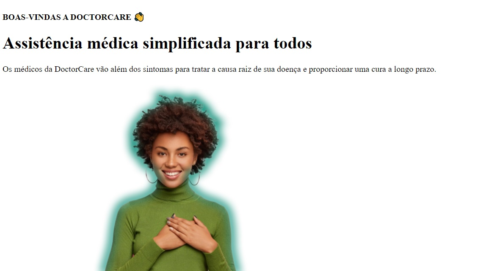

<h1 align="center">
    
</h1>

<h4 align="center"> 
	🚧 Doctor Care 🚀
</h4> 

Desafios da trilha Origin 💜 da NLW 8 Return da Rocketseat.

### 💻 Sobre o projeto

---

- Desenvolver um site para divulgar a assistência médica com html, css e javascript.
- Utilizar o template do layout a seguir para construir.

  
  

### 🚀 Layout

---

- Consultar e atender o layout do projeto no [Figma](https://www.figma.com/file/Vs48punE7RrvukfBqE5bj5/DoctorCare-(Community)?node-id=0%3A1).
- Utilizar os assets em `src/assets` para os detalhes do layout. 

### 🚀 Techs

---

- HTML
- CSS
- JavaScript

### 🛠 Construindo 

- estrutura em html
- estilização em css
- google font com @import
- lógica em javascript

### 😯 Finalizado 

- Construindo a primeira etapa.

  

### 🧭 Adicionado

- Tarefa

### 💻 Próximo passo

- Tarefa

---  

Feito com ❤️ por Douglas A B Novato 👋🏽 [Entre em contato!](https://www.linkedin.com/in/douglasabnovato/)
