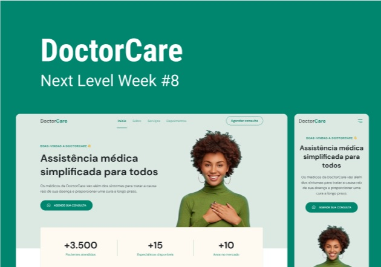

<h3 align="center"> 
	🚧 Doctor Care 🚀
</h3> 

<h1 align="center">
    
</h1>

Desafios da trilha Origin 💜 da NLW 8 Return da Rocketseat.

### 💻 Sobre o projeto

---

- Desenvolver um site para divulgar a assistência médica com html, css e javascript.
- Utilizar o template do layout a seguir para construir.

  
  

- Seguir o paradigma mobile first para desenvolver o layout.

  
  
  
  

### 🚀 Layout

---

- Consultar e atender o layout do projeto no [Figma](https://www.figma.com/file/Vs48punE7RrvukfBqE5bj5/DoctorCare-(Community)?node-id=0%3A1).
- Utilizar os assets em `src/assets` para os detalhes do layout. 

### 🚀 Techs

---

- HTML
- CSS
- JavaScript

### 🛠 Construindo 

#### v2.0-doctor-care
- padding-block: na vertical: top e bottom
- margin-inline: na horizontal: left e right
- pseudo element: header::before
- função calc para background

#### v1.0-doctor-care
- estrutura em html: tags semânticas
- estilização em css: seguindo o mobile first
- google font com link
- variáveis no css para as cores
- unidades fluídas(% e rem) e não fixas(px)
- display flex

### 😯 Finalizado 

- Construindo a aplicação em versões.

  
  

### 🧭 Adicionado

- Variação de cores

### 💻 Próximo passo

- Hospedar

---  

Feito com ❤️ por Douglas A B Novato 👋🏽 [Entre em contato!](https://www.linkedin.com/in/douglasabnovato/)
